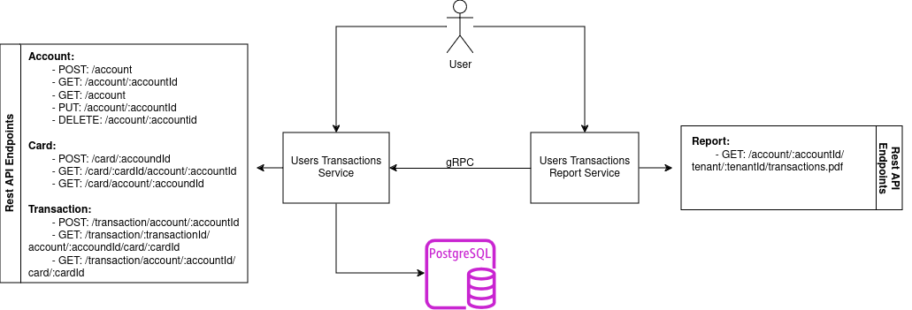

    
    <h2>Desafio Técnico Golang: Transação de Usuários </h2>

     
    
    
    
     
     

O objetivo do desafio é criar uma API RESTful para consultar transações de contas e gerar um PDF contendo as transações, focando em alta performance, escalabilidade e boas práticas de desenvolvimento.  
Fonte: https://github.com/devconductor/desafio-golang

## Sobre o desafio:

O desafio consiste na construção de dois serviços que permitam:
<ol>
    <li>Criar, consultar, atualizar e remover todas as trasações de uma determinada conta.</li>
    <li>Gerar um PDF contendo uma tabela simples com as transações de uma conta específica.</li>
</ol>

## Requisitos do Projeto:

<ol>
    <li>Criação de uma API RESTful com todos os CRUDs.</li>
    <li>Documentação com Swagger/OpenAPI.</li>
    <li>Endpoint GET /contas/{id}/transacoes.pdf para retornar um PDF com uma tabela das transações de uma conta específica.</li>
</ol>

## Diferenciais utilizados:

<ol>
    <li>Implementação de gRPC.</li>
    <li>Criação de Dockerfile para facilitar a execução do projeto em ambientes padronizados.</li>
    <li>Testes unitários abrangentes.</li>
    <li>Configuração de CI/CD utilizando GitHub Actions.</li>
    <li>Suporte a multi-tenancy.</li>
    <li>Layout e design aprimorado para o PDF gerado.</li>
</ol>

## Tecnologias Utilizadas:

<ul>
    <li><b>Linguagem</b>: Golang</li>
    <li><b>Banco de Dados</b>: PostgreSQL</li>
    <li><b>Testes Unitários</b>: Testify</li>
    <li><b>Containerização</b>: Docker</li>
    <li><b>CI/CD</b>: GitHub Actions</li>
</ul>

## Diagrama de casos de uso:

